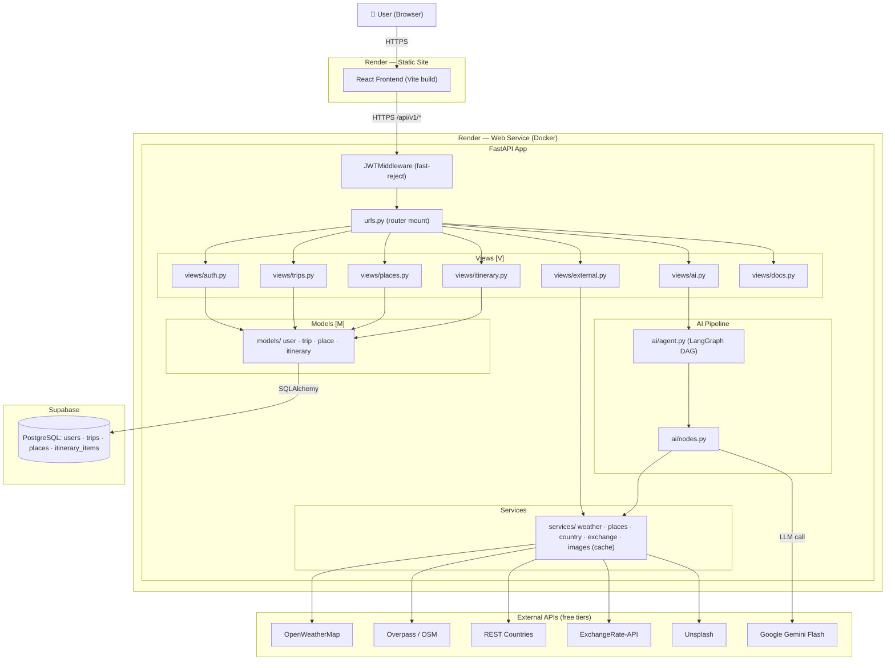
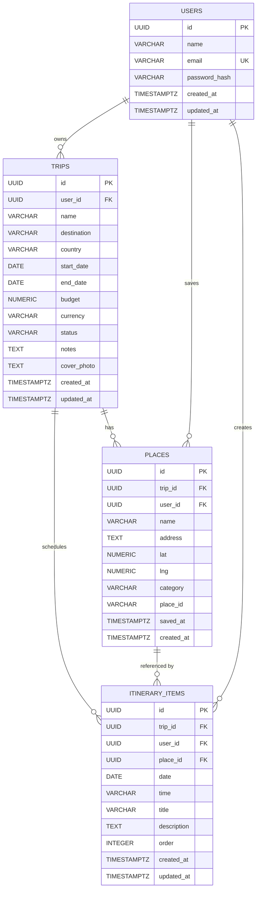
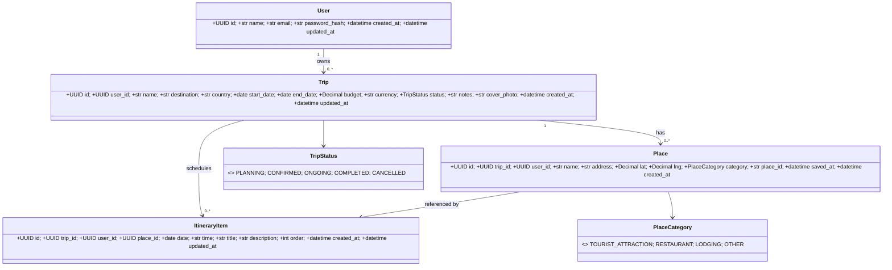
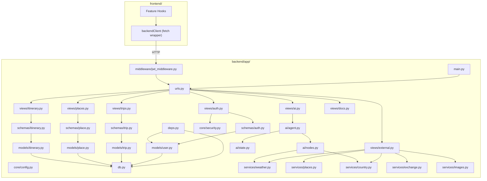
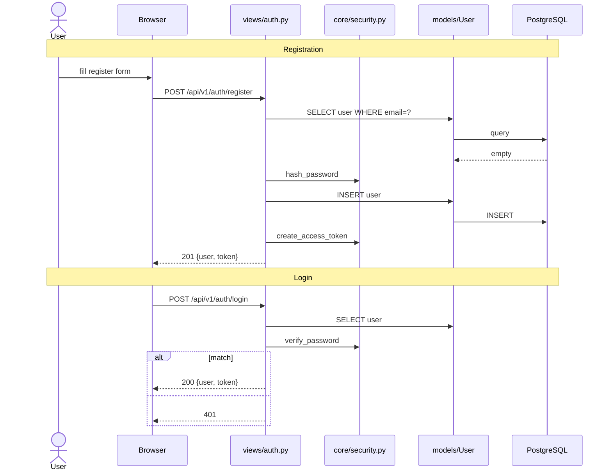
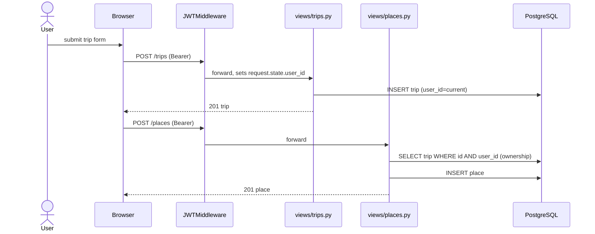
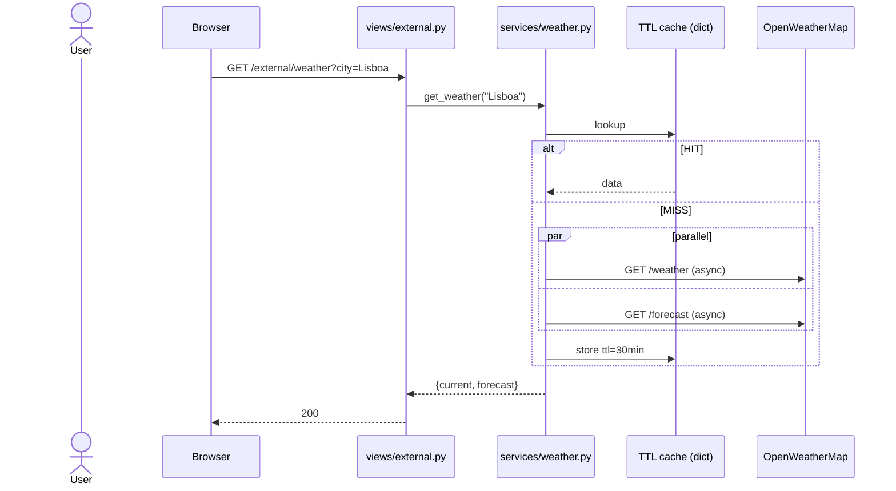
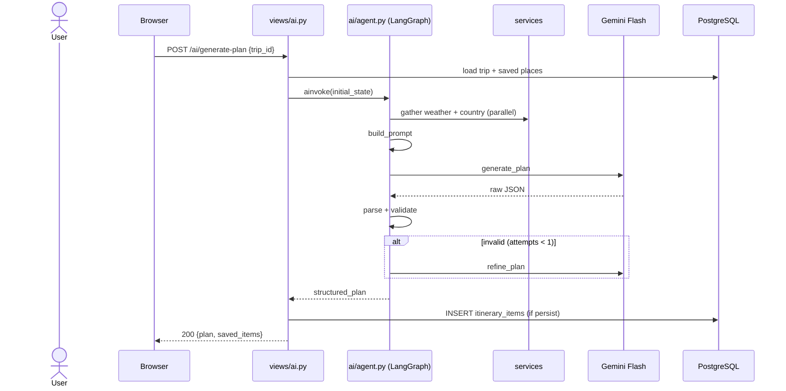
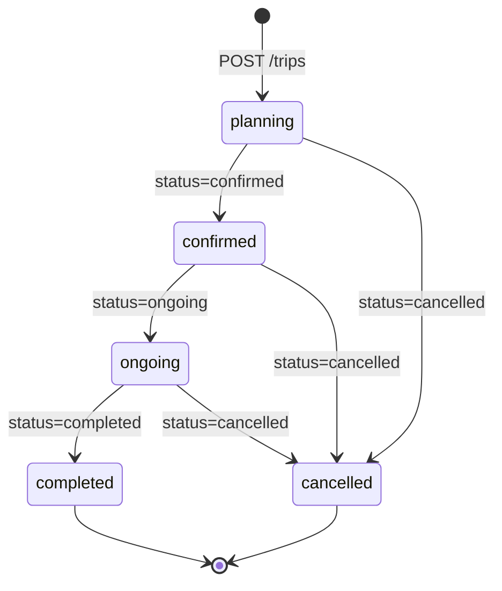

# Smart Travel Planner — Documentation

Living developer & user guide. Served at `GET /api/v1/docs-md` (HTML with Mermaid)
and `GET /api/v1/docs-md/raw` (markdown JSON for the frontend).

---

## 1. Overview

Smart Travel Planner is a cloud-deployable web app for planning trips: register,
create trips, save places of interest, build a per-day itinerary, and pull live
data (weather, country, currency, photos) from public APIs. An optional
LangGraph agent (Google Gemini Flash) generates a draft itinerary from a trip's
context.

**Stack**

- Backend: FastAPI (MVT layout) + SQLAlchemy 2.x sync + Pydantic v2
- DB: PostgreSQL (Supabase free tier)
- Auth: JWT (HS256) + bcrypt
- AI: LangGraph + `langchain-google-genai` (Gemini 1.5 Flash)
- Frontend: React (Vite) — separate folder

**Deployment** (free tiers)

- Backend → Render Web Service (Docker) — 750h/mo, sleeps after 15 min idle
- DB → Supabase PostgreSQL — 500 MB
- Frontend → Render Static Site or Vercel

---

## 2. Architecture



---

## 3. Data Model

### 3.1 ERD



### 3.2 Class Diagram



---

## 4. Backend Rules

- All protected routes require `Authorization: Bearer <token>`.
- Tokens expire after 7 days — clients re-login to refresh.
- All data is scoped to the authenticated user. Cross-user access returns 404.
- UUIDs everywhere for primary keys.
- Dates are ISO 8601 (`YYYY-MM-DD`); timestamps are UTC.
- `trips.status ∈ {planning, confirmed, ongoing, completed, cancelled}`.
- SOLID + modular monolith: each feature lives in one `views/<feature>.py`
  file; cross-feature reuse goes through `services/` or `core/`.
- All env config in `.env` (never committed). See `.env.example`.

---

## 5. AI Rules

- `POST /api/v1/ai/generate-plan` runs a LangGraph DAG with up to 2 LLM calls
  (`gather_context → build_prompt → generate_plan → parse_plan → validate_plan`,
  with one optional `refine_plan` retry).
- LLM: Gemini 1.5 Flash (free tier — 15 req/min, 1M tokens/day).
- Generated plans are persisted as `itinerary_items` and editable afterwards.
- Inputs to the AI: destination, dates, budget, currency, saved places,
  current weather, country info, free-text preferences.
- If LLM output cannot be parsed/validated → 422 with retry hint.

---

## 6. Component Diagram



---

## 7. Sequence Diagrams

### 7.1 Register + Login



### 7.2 Create Trip + Add Place



### 7.3 External Proxy (Weather) with Cache



### 7.4 AI Plan Generation



---

## 8. State Machine — Trip Lifecycle



---

## 9. Use Case Diagram

```mermaid
graph TD
    Anon["👤 Anonymous"]
    Auth["👤 Authenticated"]
    subgraph "Smart Travel Planner"
        UC1["Register"]; UC2["Login"]; UC3["View Profile"]
        UC4["Create Trip"]; UC5["List Trips"]; UC6["View Trip"]; UC7["Update Trip"]; UC8["Delete Trip"]; UC9["Change Status"]
        UC10["Save Place"]; UC11["List Places"]; UC12["Remove Place"]
        UC13["Add Activity"]; UC14["View Itinerary"]; UC15["Update Activity"]; UC16["Remove Activity"]
        UC17["Weather"]; UC18["Search Places"]; UC19["Country Info"]; UC20["Currency Convert"]; UC21["Photos"]
        UC22["Read Docs"]
        UC23["AI Generate Plan"]
    end
    Anon --> UC1 & UC2 & UC17 & UC18 & UC19 & UC20 & UC21 & UC22
    Auth --> UC3 & UC4 & UC5 & UC6 & UC7 & UC8 & UC9 & UC10 & UC11 & UC12 & UC13 & UC14 & UC15 & UC16 & UC17 & UC18 & UC19 & UC20 & UC21 & UC23
    UC9 -.->|extends| UC7
    UC23 -.->|includes| UC11
```



---

## 10. Request Limits (Free Tiers)

| Service              | Limit                              |
|----------------------|------------------------------------|
| OpenWeatherMap       | 60 req/min, 1M req/month           |
| Overpass / OSM       | ~10k req/day (no key)              |
| REST Countries       | unlimited (no key)                 |
| ExchangeRate-API     | 1,500 req/month (free fallback no-key) |
| Unsplash             | 50 req/hour (Demo)                 |
| Google Gemini Flash  | 15 req/min, 1M tokens/day          |
| Render Web Service   | 750h/mo, cold-start ~30s after idle|
| Supabase PostgreSQL  | 500 MB                             |

---

## 11. Tutorials

### 11.1 Register & Login

```bash
curl -X POST $API/api/v1/auth/register \
  -H 'Content-Type: application/json' \
  -d '{"name":"Ana","email":"ana@x.com","password":"pass1234"}'
# → 201 { user, token }

curl -X POST $API/api/v1/auth/login \
  -H 'Content-Type: application/json' \
  -d '{"email":"ana@x.com","password":"pass1234"}'
# → 200 { user, token }
```

### 11.2 Create a trip and save a place

```bash
TOKEN=...   # from /login
curl -X POST $API/api/v1/trips \
  -H "Authorization: Bearer $TOKEN" -H 'Content-Type: application/json' \
  -d '{"name":"Lisboa em maio","destination":"Lisboa","country":"Portugal",
       "start_date":"2026-05-10","end_date":"2026-05-15","budget":3000,"currency":"EUR"}'
```

### 11.3 Generate an AI itinerary

```bash
curl -X POST $API/api/v1/ai/generate-plan \
  -H "Authorization: Bearer $TOKEN" -H 'Content-Type: application/json' \
  -d '{"trip_id":"<uuid>","preferences":"vegetarian, museums, walking"}'
```

### 11.4 External proxies (no auth)

```bash
curl "$API/api/v1/external/weather?city=Lisboa"
curl "$API/api/v1/external/country?name=Portugal"
curl "$API/api/v1/external/exchange?from=USD&to=BRL&amount=100"
curl "$API/api/v1/external/images?query=Lisbon"
```

---

## 12. Deployment Guide

### Local (Docker)

```bash
cp backend/.env.example backend/.env   # edit values
docker compose -f backend/docker-compose.yml up --build
# API at http://localhost:8000  (Swagger at /docs)
```

### Cloud (Render + Supabase)

1. Create a Supabase project → copy `DATABASE_URL` (pooler URL).
2. Apply schema once: `psql "$DATABASE_URL" -f db/schema.sql`.
3. Render → New Web Service → Docker → point at `backend/` directory.
4. Set env vars from `.env.example` in Render dashboard.
5. Health check path: `/health`.

---

## 13. Testing

`pytest` is the test runner. Tests live under `backend/tests/` and exercise
the FastAPI app via `fastapi.testclient.TestClient` (no real network).

### Running tests

| Goal                 | Command                                                        |
|----------------------|----------------------------------------------------------------|
| Inside Docker        | `docker compose run --rm app pytest -vv`                       |
| Local venv           | `PYTHONPATH=app pytest -vv` (after `uv pip install -e ".[dev]"`)|
| Single file          | `pytest tests/test_auth.py -vv`                                |
| Single test          | `pytest tests/test_auth.py::test_register -vv`                 |
| Coverage             | `pytest --cov=. --cov-report=term-missing`                     |
| Makefile shortcut    | `make test`                                                    |

Required env for the test process (only what `core/config` reads at import):

```bash
export SECRET_KEY=test-secret
export DATABASE_URL=sqlite:///./_test.db   # or :memory: when overriding get_db
```

### Test layout

```
backend/tests/
├── conftest.py          # shared fixtures (client, db, auth_headers)
├── test_auth.py         # register / login / me / change-password
├── test_trips.py        # CRUD + ownership scoping
├── test_places.py
├── test_itinerary.py    # day-grouped GET
├── test_external.py     # services with httpx mocks
└── test_ai.py           # LangGraph agent with LLM stubbed out
```

### Recommended `conftest.py`

```python
import pytest
from fastapi.testclient import TestClient
from sqlalchemy import create_engine
from sqlalchemy.orm import sessionmaker

from main import app
from db import Base
from deps import get_db

@pytest.fixture
def db_engine():
    eng = create_engine("sqlite:///:memory:",
                        connect_args={"check_same_thread": False})
    Base.metadata.create_all(eng)
    yield eng
    Base.metadata.drop_all(eng)

@pytest.fixture
def client(db_engine):
    Session = sessionmaker(bind=db_engine)
    def _get_db():
        db = Session()
        try: yield db
        finally: db.close()
    app.dependency_overrides[get_db] = _get_db
    yield TestClient(app)
    app.dependency_overrides.clear()

@pytest.fixture
def auth_headers(client):
    client.post("/api/v1/auth/register",
                json={"name":"T","email":"t@x.com","password":"pass1234"})
    r = client.post("/api/v1/auth/login",
                    json={"email":"t@x.com","password":"pass1234"})
    return {"Authorization": f"Bearer {r.json()['token']}"}
```

### Mocking external HTTP calls

Use `respx` (httpx mock) so tests stay offline and deterministic:

```python
import respx, httpx
@respx.mock
def test_weather_proxy(client):
    respx.get("https://api.openweathermap.org/data/2.5/weather").mock(
        return_value=httpx.Response(200, json={"weather":[{"description":"clear"}]}))
    respx.get("https://api.openweathermap.org/data/2.5/forecast").mock(
        return_value=httpx.Response(200, json={"list":[]}))
    r = client.get("/api/v1/external/weather?city=Lisbon")
    assert r.status_code == 200
```

### Mocking the AI agent

The LangGraph agent is built lazily by `ai.agent.get_agent()` and cached.
Override the cached value to keep tests offline:

```python
import ai.agent as agent_mod

class FakeAgent:
    async def ainvoke(self, state):
        return {"structured_plan": [
            {"date": state["trip"]["start_date"], "activities":[
                {"time":"09:00","title":"Walk","description":""}]}]}

def test_generate_plan(client, auth_headers, monkeypatch):
    monkeypatch.setattr(agent_mod, "get_agent", lambda: FakeAgent())
    # ... POST /api/v1/ai/generate-plan and assert
```

### Test case catalogue

The suite covers six functional areas. Each `TC-NN` maps to one `pytest` test
with the same id in its name (e.g. `test_tc01_register_valid`).

#### 13.1 Authentication & Security — `test_auth.py`

| ID    | Scenario                                                                                  | Expected |
|-------|-------------------------------------------------------------------------------------------|----------|
| TC-01 | Register a new user with valid data                                                       | 201 + JWT |
| TC-02 | Register with an email that already exists                                                | 409 |
| TC-03 | Login with valid credentials                                                              | 200 + token + user |
| TC-04 | Login with wrong password                                                                 | 401 |
| TC-05 | Hit `/trips` without `Authorization` header (rejected by `JWTMiddleware`)                 | 401 |
| TC-06 | Hit a protected route with an expired or malformed token                                  | 401 |
| TC-07 | Password is bcrypt-hashed in DB (never stored in plain text)                              | hash differs from plain |

#### 13.2 Trip Management (CRUD) — `test_trips.py`

| ID    | Scenario                                                                                  | Expected |
|-------|-------------------------------------------------------------------------------------------|----------|
| TC-08 | Create trip with valid dates + destination                                                | 201, row persisted |
| TC-09 | Create trip with `end_date < start_date`                                                  | 422 |
| TC-10 | List trips returns only the authenticated user's trips                                    | other user's trips absent |
| TC-11 | Get trip by id — owner only                                                               | 200 for owner, 404 for stranger |
| TC-12 | Update trip status `planning → confirmed → ongoing → completed`                           | 200 each transition |
| TC-13 | Delete trip cascades to places + itinerary items                                          | 204; child rows gone |

#### 13.3 Places & Itinerary — `test_trips.py`

| ID    | Scenario                                                                                  | Expected |
|-------|-------------------------------------------------------------------------------------------|----------|
| TC-14 | Save a place to an owned trip                                                             | 201 |
| TC-15 | Save a place to someone else's trip                                                       | 404 (ownership-blind) |
| TC-16 | Create itinerary item on a date inside the trip range                                     | 201 |
| TC-17 | `GET /itinerary/{trip_id}` groups items by date and orders by `(date, order)`             | day_number ascending, activities chronological |

#### 13.4 External Services & Cache — `test_external_proxy.py`

| ID    | Scenario                                                                                  | Expected |
|-------|-------------------------------------------------------------------------------------------|----------|
| TC-18 | Weather route returns a clean error when OpenWeather fails                                | 502/503 with `detail` |
| TC-19 | In-memory cache: second call for the same city does not hit the upstream API             | upstream mock called once |
| TC-20 | Currency conversion math is correct given a mocked rate                                   | `converted == amount * rate` |
| TC-21 | Unsplash proxy forwards the `query` and `per_page` params verbatim                        | mock receives same params |

#### 13.5 AI Agent (LangGraph) — `test_ai_planner.py`

| ID    | Scenario                                                                                  | Expected |
|-------|-------------------------------------------------------------------------------------------|----------|
| TC-22 | Successful generation: prompt includes weather + country context                          | substrings present in prompt |
| TC-23 | LLM JSON output is parsed into the Pydantic itinerary schema                              | `structured_plan` matches expected days |
| TC-24 | Refinement: invalid first output triggers one retry, second succeeds                      | `attempts == 1`, plan valid |

#### 13.6 Documentation & Migrations — `test_external_proxy.py` (misc)

| ID    | Scenario                                                                                  | Expected |
|-------|-------------------------------------------------------------------------------------------|----------|
| TC-25 | `GET /api/v1/docs-md` returns valid HTML with `<html>` + Mermaid hook                     | 200, `text/html` |
| TC-26 | Schema integrity: `Base.metadata.create_all` produces the same tables as `db/schema.sql` | tables `users, trips, places, itinerary_items` all present |

### CI

The same commands run unchanged in CI (GitHub Actions / Render preview).
A typical job: install deps with `uv pip install -e ".[dev]"`, export
`SECRET_KEY` + `DATABASE_URL`, then `pytest -vv --cov=.`.

> The legacy `tests/test_*` files in the repo target the removed ML predictor
> and should be deleted/rewritten against the new MVT views as features land.

---

## 14. Changelog

- **0.2.0** — MVT rearchitecture; auth + trips + places + itinerary + external
  proxies + AI planner; documentation route; Docker for cloud deploy.
- **0.1.0** — initial cookiecutter scaffold.
